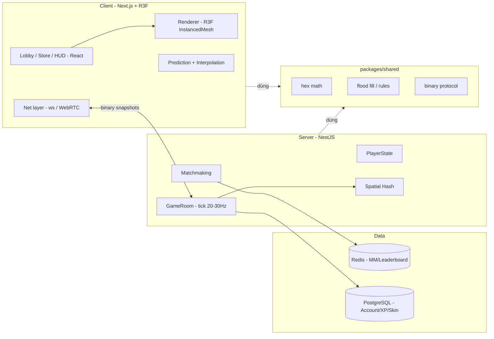

# 02 — Architecture

## Nguyên tắc chủ đạo

> **Tách logic khỏi render.** Toàn bộ luật chơi là TypeScript thuần, deterministic,
> không phụ thuộc React/Three. Nhờ đó: (1) test bằng unit test, (2) tái dùng nguyên
> vẹn trên server authoritative sau này.

## Sơ đồ tổng thể (bản full, tương lai)



## MVP (bản hiện tại) — chỉ Client

```
Next.js page (/play)
  └─ GameCanvas (R3F Canvas, OrthographicCamera)
       ├─ useGameLoop  → gọi GameState.tick() theo nhịp
       ├─ HexGridView  → InstancedMesh, đọc màu từ GameState
       ├─ input (chuột) → set hướng mong muốn
       └─ HUD (React)  → % diện tích, King banner
GameState (TS thuần)
  ├─ map: tập ô hợp lệ
  ├─ owned: Set<key>
  ├─ trail: key[] + Set<key>
  ├─ head: {q,r}, dir
  ├─ tick(): di chuyển, phát hiện khép vòng / va chạm, gọi capture()
  └─ capture(): flood fill (xem 03-hex-math.md)
```

## Mô hình di chuyển: LIÊN TỤC (pixel)

Nhân vật luôn tiến về phía `heading` với tốc độ cố định (`CONFIG.SPEED`), quay đầu
mượt về phía con trỏ (giới hạn `CONFIG.TURN_RATE`). Lãnh thổ vẫn là tập ô hex.

### Vòng đời một frame (`GameState.update(dt)` → `moveTo(x,y)`)

1. Xoay `heading` về `targetHeading` (chuột), giới hạn tốc độ quay → chuyển hướng mượt.
2. `pos += (cosθ, sinθ) · SPEED · dt`; gọi `moveTo(pos)`.
3. Sân là **hình chữ nhật** (`mapRect`, biên thẳng). Chạm biên → **clamp vị trí theo
   từng trục**: thành phần song song biên vẫn đi tiếp → trượt mượt, không dừng/giật.
   `nextHex = pixelToAxial(pos)` (lề `MAP_MARGIN` đảm bảo luôn rơi vào ô hợp lệ).
4. Nếu đổi ô: **nội suy** `hexLinedraw(currentHex, nextHex)` để không bỏ sót ô khi đi
   nhanh; với mỗi ô trên đường:
   - ∈ `owned`: nếu đang có đuôi → **capture()** (flood fill), dọn đuôi.
   - ∈ `trail`: **chết** → `reset()`.
   - trung lập: thêm vào `trail` (barrier). Ô neutral đầu tiên → seed điểm vẽ đuôi.
5. Nếu đang ở ngoài: ghi thêm điểm vào `trailPoints` (chuỗi điểm để vẽ line mượt),
   giãn cách tối thiểu `TRAIL_POINT_DIST`.
6. HUD cập nhật % diện tích & trạng thái King (~5 lần/giây).

> `revision` tăng khi thực thể đổi (đuôi/vị trí) — cho renderer cube/tube.
> `gridRevision` tăng khi owned HOẶC hex-đuôi đổi — cho renderer lưới (tránh tô mỗi frame).

## Ranh giới module (để sub-agent không dẫm chân)

Từ **Pha 2**, logic đã tách sang `packages/shared` (xem bên dưới). Ranh giới hiện tại:

| Module | Vai trò | Không được sửa |
|--------|---------|----------------|
| `packages/shared/src/{hex,floodfill,arena}.ts` | toán hex, flood fill, hình học sân | render |
| `packages/shared/src/state.ts` | `GameState` deterministic (chỉ import trong shared) | render |
| `packages/shared/src/{protocol,spatialhash}.ts` | wire-format nhị phân + broad-phase va chạm | render |
| `packages/client/src/components/*` (R3F) | render + input | logic trong `shared` |
| `packages/client/src/net/*` | net layer client (predict/interp) | logic authoritative trong `shared`/`server` |
| `packages/server/src/*` (NestJS + ws) | GameRoom authoritative, transport | logic trong `shared` (chỉ import) |

## Monorepo (Pha 2 — ĐÃ TÁCH)

```
packages/
  shared/   # @hexagon/shared — logic thuần TS deterministic, build tsc → dist (CJS)
  client/   # @hexagon/client — Next.js + R3F, import @hexagon/shared
  server/   # @hexagon/server — NestJS (standalone context, không HTTP) + ws
```

- Công cụ: **pnpm workspaces** (qua corepack). `node-linker=hoisted`. Xem
  [05-roadmap.md](05-roadmap.md) và báo cáo [REPORT-pha-2.md](REPORT-pha-2.md).
- Server chạy `GameState.update(dt)` là **nguồn chân lý** (tick cố định); client gửi
  INPUT (heading) và **render snapshot** — không gửi vị trí.
- **Client-side prediction** cho đầu người chơi (`stepHead` khớp `updateEntity` của server)
  để che độ trễ; **reconcile** theo `ackSeq` trong snapshot; **interpolation** cho thực
  thể khác (trễ ~100 ms).

## Hiệu năng (đông bot)

Triệu chứng cũ: tăng bot (≈20) → GIẬT không chơi nổi. Nguyên nhân & khắc phục:

1. **`captureEnclosed` (shared/floodfill.ts) — thủ phạm chính (~97% CPU mô phỏng).** Mỗi
   lần khép vòng chiếm đất quét TOÀN bản đồ (~8000 ô) → **9.6 ms/lần**; nhiều bot khép vòng
   cùng tick ⇒ đơ khung. Sửa: chỉ loang trong **cửa sổ = bbox(owned ∪ trail) + 1 vành**
   (interior luôn nằm trong đó) → **0.19 ms/lần (~50×)**, `update()` 20 bot: 6.9 → 0.54
   ms/tick (~13×). Đã kiểm chứng **0 sai khác** vs bản quét toàn map qua 1412 lần chiếm.
2. **`TrailLine` (client) dựng lại `TubeGeometry` MỖI FRAME / mỗi thực thể** (tới 600 đoạn)
   ⇒ GC dồn. Sửa: chỉ dựng lại khi ĐUÔI đổi (chữ ký: số điểm + điểm đầu), pool Vector3, hạ
   trần đoạn 600→200, radial 8→6.
3. **AI bot: `steerAvoiding`** với `skill` lớn (hồ sơ "Khó") cho dist/số lần quét khổng lồ,
   luôn thất bại. Sửa: kẹp `dist ≤ ARENA_R·0.33` và `maxK ≤ 18`.

4. **Render dựng lại MỖI FRAME theo `gridRevision`.** Đo với 20 bot: `gridRevision` đổi ở
   **56% số frame** (mỗi ô đuôi thêm vào cũng bump) ⇒ cả `HexGridView` (tô lại ~8000
   instance) LẪN `TerritoryBorders` dựng lại > nửa số frame. `TerritoryBorders` nặng nhất:
   **1,35 ms/frame và TĂNG theo diện tích** + cấp phát `Float32Array` mới mỗi lần ⇒ GC giật.
   Sửa: thêm `GameState.territoryRevision` (chỉ bump khi CHỦ ô đổi, không kể đuôi) và gate
   `TerritoryBorders` theo nó → dựng lại chỉ còn **10% frame (giảm 5,6×)**; đồng thời DÙNG
   LẠI buffer đỉnh (DynamicDrawUsage, cấp dôi 1,5×) → hết cấp phát mỗi frame. `HexGridView`
   (0,43 ms/frame) giữ nguyên vì màu đuôi phải cập nhật theo `gridRevision`.

5. **`pickSpawnHex` — SPIKE ~500 ms (thủ phạm chính của "giật" thực sự).** Đo p99 = 466 ms,
   MAX = 519 ms/frame (p50 chỉ 0,41 ms → phần lớn frame ổn, nhưng thỉnh thoảng đơ nửa giây).
   `clearAround` duyệt TOÀN BỘ ô owned (O(owned)) cho mỗi ứng viên; lúc bản đồ đông, bước quét
   dự phòng = 7957 ô × ~3700 owned ≈ **29 TRIỆU phép/​lần**, chạy mỗi lần bot hồi sinh + mỗi
   0,2 s khi người chơi đang chết (`canRevive`). Sửa: `clearAround` chỉ quét ĐĨA hex bán kính
   `SPAWN_CLEARANCE` quanh ứng viên (O(clearance²), độc lập diện tích); BOT bỏ qua bước quét
   xác định (chờ lần hồi sinh sau). Kết quả: MAX **519 → 4,94 ms**, p99 **466 → 1,93 ms**.

Đo FPS tại chỗ: overlay `FpsMeter` (góc trên-trái). Tắt/bật lớp hiển thị để giảm tải qua
`CONFIG.DISPLAY` (FPS / HUD / MINIMAP / TRAILS / PARTICLES / TERRITORY_BORDERS) —
`TRAILS=false` là công tắc giảm tải mạnh nhất khi máy yếu.
