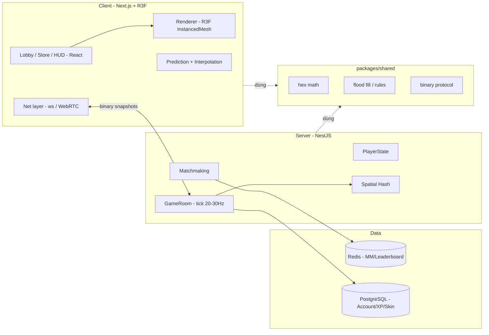

# 02 — Architecture

## Nguyên tắc chủ đạo

> **Tách logic khỏi render.** Toàn bộ luật chơi là TypeScript thuần, deterministic,
> không phụ thuộc React/Three. Nhờ đó: (1) test bằng unit test, (2) tái dùng nguyên
> vẹn trên server authoritative sau này.

## Sơ đồ tổng thể (bản full, tương lai)



## MVP (bản hiện tại) — chỉ Client

```
Next.js page (/play)
  └─ GameCanvas (R3F Canvas, OrthographicCamera)
       ├─ useGameLoop  → gọi GameState.tick() theo nhịp
       ├─ HexGridView  → InstancedMesh, đọc màu từ GameState
       ├─ input (chuột) → set hướng mong muốn
       └─ HUD (React)  → % diện tích, King banner
GameState (TS thuần)
  ├─ map: tập ô hợp lệ
  ├─ owned: Set<key>
  ├─ trail: key[] + Set<key>
  ├─ head: {q,r}, dir
  ├─ tick(): di chuyển, phát hiện khép vòng / va chạm, gọi capture()
  └─ capture(): flood fill (xem 03-hex-math.md)
```

## Mô hình di chuyển: LIÊN TỤC (pixel)

Nhân vật luôn tiến về phía `heading` với tốc độ cố định (`CONFIG.SPEED`), quay đầu
mượt về phía con trỏ (giới hạn `CONFIG.TURN_RATE`). Lãnh thổ vẫn là tập ô hex.

### Vòng đời một frame (`GameState.update(dt)` → `moveTo(x,y)`)

1. Xoay `heading` về `targetHeading` (chuột), giới hạn tốc độ quay → chuyển hướng mượt.
2. `pos += (cosθ, sinθ) · SPEED · dt`; gọi `moveTo(pos)`.
3. Sân là **hình chữ nhật** (`mapRect`, biên thẳng). Chạm biên → **clamp vị trí theo
   từng trục**: thành phần song song biên vẫn đi tiếp → trượt mượt, không dừng/giật.
   `nextHex = pixelToAxial(pos)` (lề `MAP_MARGIN` đảm bảo luôn rơi vào ô hợp lệ).
4. Nếu đổi ô: **nội suy** `hexLinedraw(currentHex, nextHex)` để không bỏ sót ô khi đi
   nhanh; với mỗi ô trên đường:
   - ∈ `owned`: nếu đang có đuôi → **capture()** (flood fill), dọn đuôi.
   - ∈ `trail`: **chết** → `reset()`.
   - trung lập: thêm vào `trail` (barrier). Ô neutral đầu tiên → seed điểm vẽ đuôi.
5. Nếu đang ở ngoài: ghi thêm điểm vào `trailPoints` (chuỗi điểm để vẽ line mượt),
   giãn cách tối thiểu `TRAIL_POINT_DIST`.
6. HUD cập nhật % diện tích & trạng thái King (~5 lần/giây).

> `revision` tăng khi thực thể đổi (đuôi/vị trí) — cho renderer cube/tube.
> `gridRevision` tăng khi owned HOẶC hex-đuôi đổi — cho renderer lưới (tránh tô mỗi frame).

## Ranh giới module (để sub-agent không dẫm chân)

| Module | Sở hữu bởi task | Không được sửa |
|--------|-----------------|----------------|
| `src/game/hex.ts` | Task A | logic capture, render |
| `src/game/floodfill.ts` | Task B | render |
| `src/game/state.ts` | Task C | render, chỉ import hex+floodfill |
| `src/components/*` (R3F) | Task D | logic trong `src/game` |
| `app/*` (routing, HUD) | Task E | logic trong `src/game` |

## Chuyển sang server authoritative (sau)
- `src/game/*` → `packages/shared`.
- Server chạy `GameState.tick()` là nguồn chân lý; client chỉ render snapshot + nội suy.
- Client-side prediction cho đầu người chơi để che độ trễ; reconcile theo snapshot.
